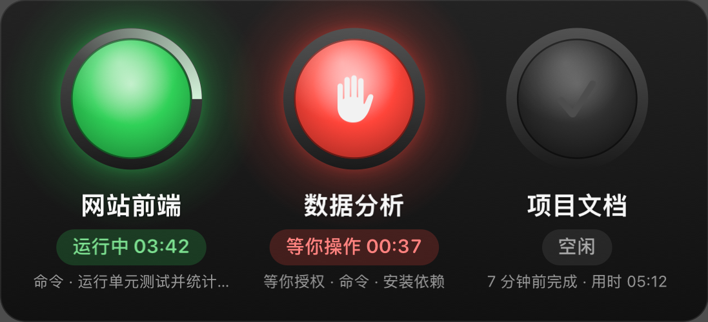

# Watchlamp

[English](README.md) | 简体中文

*A status light for Claude Code on macOS: one lamp per session, readable from across the room.*

适用于 Claude Code 的醒目提醒灯：在 Mac 屏幕上放一块悬浮灯板，每个 Claude Code 会话一盏灯，
哪个项目在跑、哪个在等你，隔着半个房间也看得清。桌面版（Code 标签页）和终端里的 `claude` 都支持。



| 灯（默认"经典"配色） | 含义 | 下面的文字 |
|---|---|---|
| 🟢 绿色，光晕呼吸，灯圈上有一道光在转 | 运行中 | 本轮已运行多久、正在做什么（如"命令 · 运行测试"） |
| 🔴 红色 + ✋，快速闪烁 | 等你操作：授权确认、回答问题、确认计划；出错停下时显示 ❗ | 等了多久、等的是什么 |
| ⚫ 熄灭 + ✓ | 空闲：这一轮做完了 | 多久前完成、用时多少 |

另外可以让**屏幕边框发光**（所有屏幕一起亮，鼠标可以直接穿过去点）。默认只在"等你操作"时闪框，也可以改成运行中也亮。

还会**响一声提醒**：等你操作时一种声音，一轮做完时另一种。两秒内就点掉的授权不会响，自己按 Esc 中断的也不会响。

界面支持 12 种语言：English、Español、Português (Brasil)、Français、Deutsch、Italiano、Русский、العربية、日本語、한국어、简体中文、繁體中文。默认跟随系统语言，也可以在菜单"语言"里单独切换；阿拉伯语下灯板会左右镜像。

## 使用

- **移动**：直接拖灯板，放在主屏或扩展屏都行，位置会记住。也可以用菜单"把灯板移到"一键放到某块屏幕。
- **点一下灯**：切换到这个会话所在的 app（Claude 桌面版、终端、VS Code……）。
- **右键灯板**或点**菜单栏的小圆点**打开设置：
  - 灯的大小：小 / 中 / 大 / 特大 / 巨大 / 最大（离得远就选大一点）
  - 横排 / 竖排（横排一行最多 4 盏，多了自动换行）
  - 配色：经典（运行绿、等你红）、轮到你（干活红、点一下黄、轮到你绿，站在你的角度看）、色弱友好（运行蓝、等你橙）
  - 显示正在做什么、屏幕边框发光、没有会话时隐藏、登录时自动启动
  - 总在最前（默认开，全屏 App 上也看得到）；关掉后灯板像普通窗口一样会被别的窗口挡住，点一下回到前面
  - 音效：等你操作和完成时都响（默认）、只在等你操作时响、关闭；两种声音都能换成系统提示音或 `~/Library/Sounds` 里的声音；
    音量 10%–400%，超过 100% 时比同样系统音量下其他应用的提示音更响
  - 演示三种状态（12 秒，在灯板上放三盏示例灯）、语言
  - 检查更新；评价、提建议（在 App 里直接提交，评价经审核后显示在 [Watchlamp 的网页](https://thermport.com/zh/watchlamp/) 上）；
    打赏（在浏览器里打开 Lemon Squeezy 的结账页）
- 同一个项目开了多个会话时，会显示成"项目名 #1""项目名 #2"。鼠标停在灯上能看到完整路径。

> 小提示：MacBook 菜单栏图标太多时，macOS 会把放不下的图标藏到刘海后面。菜单栏里看不到小圆点时，右键灯板打开的是同一个菜单。

## 安装

1. 从 [thermport.com/watchlamp](https://thermport.com/zh/watchlamp/) 下载 dmg 安装包，双击打开。
2. 把 Watchlamp 拖进"应用程序"文件夹，再从"应用程序"里打开它。
3. 第一次打开会问要不要连接 Claude Code，点"连接 Claude Code"（"登录时自动启动"默认已勾上）。

需要 macOS 13 或更新版本，Apple 芯片和 Intel 芯片的 Mac 都能用。安装包已签名并经过苹果公证，打开时不会被拦截。
还没装 Claude Code 也没关系：装好以后在菜单里点"连接 Claude Code"。

- **连接做了什么**：在 `~/.claude/settings.json` 里加上 Watchlamp 的钩子。改之前会把原文件备份到
  `~/.claude/watchlamp/backups/`，只增删命令里带 `Watchlamp` 的钩子，其他设置原样保留。
- **更新**：先退出 Watchlamp，把新版拖进"应用程序"替换旧版，再打开。
- **卸载**：菜单里点"断开 Claude Code"，退出 Watchlamp，把它拖到废纸篓。
  直接删掉也没关系，留下的钩子找不到 App 时什么都不做；想清干净的话再删掉 `~/.claude/watchlamp`。

### 从源码安装

需要 Xcode 或 Command Line Tools（`swiftc`）：

```bash
git clone https://github.com/xiongqiutang/watchlamp.git
cd watchlamp
./install.sh     # 编译 → 装到 ~/Applications/Watchlamp.app → 连接 Claude Code → 启动
./uninstall.sh   # 断开 Claude Code，移除登录项、App 和状态文件
```

## 工作原理

```
Claude Code ──hook 事件(JSON)──▶ Watchlamp hook ──▶ ~/.claude/watchlamp/sessions/<会话id>.json
                                                                │ 每 0.5 秒读取
                                 悬浮灯板 + 屏幕边框 + 菜单栏图标 ◀─┘
```

- 钩子注册在 `~/.claude/settings.json`：SessionStart / UserPromptSubmit / PreToolUse / PostToolUse /
  PermissionRequest / Notification / Stop / StopFailure / SubagentStart/Stop 等 16 个事件。
- `Watchlamp hook` 每次约 15 ms，不输出任何内容、永远返回 0，不会拦截或改变 Claude 的行为。
- 整个 App 约 1 MB（Apple 芯片和 Intel 两份代码都在里面），安装包约 0.6 MB；CPU 不到 1%，内存约 16 MB（macOS 上一个只有菜单栏图标和一个窗口的空白 App 就要约 12 MB）。
  提示音在一个单独的短进程里播放（`Watchlamp play-sound`），音频组件不会加载进 Watchlamp 本身；
  音量超过 100% 时用系统的峰值限幅器放大，不会破音。
- 启动时和之后每天检查一次更新（读取 thermport.com/watchlamp/version.json，在一个单独的短进程里完成，网络组件不会加载进 Watchlamp 本身），有新版本时发一条系统通知；除此之外，只有点"检查更新"或发送评价、建议时才联网。
- 会话的 Claude Code 进程退出后，灯会在 2 秒内自动消失；12 小时没有动静的会话也会被清理。
- 后台子代理 / 工作流还在跑时灯保持亮着；后台 shell（比如 dev server）不算"运行中"。

## 已知限制

- 批准授权后，要等这个工具执行完灯才从"等你"变成"运行中"（Claude Code 没有"已批准"这个事件）。
- 按 Esc 或停止按钮中断时没有 Stop 事件，灯板通过读会话记录发现中断，最多晚 2 秒熄灯。

## 开发

```
Sources/                  Swift 源码：Hook（事件→状态）、Model、Store、Board（灯板）、EdgeGlow（屏幕边框）、
                          App（菜单）、Chime（何时响）、Player（播放提示音）、Forms（评价 / 建议窗口）、
                          Website（检查更新、打赏）、Connection（连接 / 断开 Claude Code）、Lang（多语言）
Resources/*.lproj/        各语言的界面文字（键就是英文原文，缺的翻译会显示英文；selftest.sh 会检查每种语言是否齐全）
scripts/selftest.sh       用模拟事件跑一遍状态机，再测连接 / 断开和各语言翻译
scripts/devtools.sh       开发版命令（不打包进 App）：snapshot 离屏渲染灯板截图（可指定语言）、status 列出会话
scripts/release.sh        打发布包：Developer ID 签名 → 苹果公证 → 做 dmg → dmg 再公证
scripts/RenderIcon.swift  编译时画 App 图标
```

`build.sh` 同时编译 Apple 芯片和 Intel 两种架构。命令行也能连接 / 断开：
`Watchlamp.app/Contents/MacOS/Watchlamp connect`（或 `disconnect`、`connection` 查看状态）。

发新版本：改 `Resources/Info.plist` 里的版本号（`CFBundleShortVersionString`、`CFBundleVersion`），然后运行

```bash
NOTARY_PROFILE=<公证凭据名> scripts/release.sh   # 生成 dist/Watchlamp-<版本>.dmg
```

需要钥匙串里有 "Developer ID Application" 证书（有多张时自动选有效期最长的，也可以用 `SIGN_ID` 指定），
以及用 `xcrun notarytool store-credentials <公证凭据名>` 存好的公证凭据。

---

Watchlamp 是个人开源项目，与 Anthropic 没有关联。Claude 和 Claude Code 是 Anthropic 的商标。
